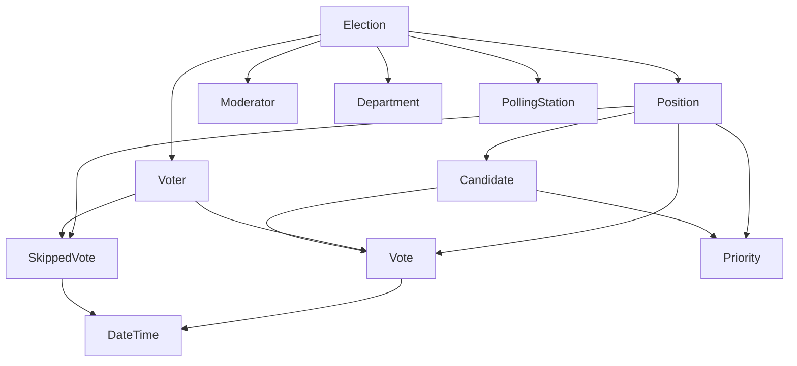

# Univoting Akka.NET Architecture

## Model Relationships (From UnivotingContext.cs Analysis)

The Univoting system follows a hierarchical domain model centered around elections:

### Core Domain Relationships



### Entity Details

1. **Election** (Aggregate Root)
   - Contains: Positions, Voters, Moderators, Departments, PollingStations
   - Properties: Name, Description, Logo, BrandColour

2. **Position** 
   - Belongs to: Election
   - Contains: Candidates, Votes, SkippedVotes
   - Has optional: Priority
   - Properties: Name, RankId

3. **Voter**
   - Belongs to: Election
   - Has many: Votes, SkippedVotes
   - Properties: Name, IdentificationNumber, VotingStatus

4. **Vote/SkippedVote**
   - Constrained relationships with Restrict delete behavior
   - Ensures data integrity for audit trails

## Akka.NET Architecture

### Current Implementation Status: ✅ **ALREADY REFACTORED**

The system is already well-architected using Akka.NET with:

### Actor Hierarchy

```
VotingSupervisorActor (or EnhancedVotingSupervisorActor)
├── ElectionsParent
│   └── ElectionActor (per election ID)
├── PositionsParent  
│   └── PositionActor (per position ID)
└── VotersParent
    └── VoterActor (per voter ID)
```

### Key Features

#### 1. **Event Sourcing Implementation**
- ✅ Persistent actors with event replay
- ✅ Snapshot support for performance
- ✅ Command/Event separation
- ✅ SQLite event store

#### 2. **Domain-Driven Design**
- ✅ Aggregate boundaries (Election as root)
- ✅ Business rule enforcement
- ✅ Consistent state management
- ✅ Entity isolation

#### 3. **Scalability Features**
- ✅ Actor per entity pattern
- ✅ Message-driven architecture
- ✅ Location transparency
- ✅ Fault tolerance

### Enhanced Actors (New Additions)

#### **PositionActor**
```csharp
// Dedicated actor for position-specific logic
public class PositionActor : ReceivePersistentActor
{
    // Manages candidates, votes, and vote validation
    // Provides voting results and statistics
    // Ensures vote integrity per position
}
```

**Key Features:**
- Vote validation (no double voting)
- Candidate management
- Real-time vote counting
- Results calculation with ranking

#### **VoterActor** 
```csharp
// Dedicated actor for voter state management
public class VoterActor : ReceivePersistentActor
{
    // Tracks voting progress and eligibility
    // Maintains voting history
    // Enforces voter-specific rules
}
```

**Key Features:**
- Voting eligibility checking
- Progress tracking across positions
- Historical vote record
- Status management (Pending → InProgress → Voted)

#### **EnhancedVotingSupervisorActor**
```csharp
// Orchestrates between different entity types
public class EnhancedVotingSupervisorActor : UntypedActor
{
    // Coordinates voting operations
    // Provides election-wide statistics
    // Manages cross-entity workflows
}
```

**Key Features:**
- Cross-entity coordination
- Election statistics aggregation
- Workflow orchestration
- Message routing optimization

### Message Types

#### **Commands** (Intent to change state)
```csharp
public abstract record VotingCommand;

// Examples:
public record CreateElection(string ElectionId, string Name, ...) : VotingCommand;
public record CastVote(string VoterId, string CandidateId, string PositionId) : VotingCommand;
public record CheckVoterEligibility(string VoterId, string PositionId) : VotingCommand;
```

#### **Events** (State changes that occurred)
```csharp
public abstract record VotingEvent;

// Examples:
public record ElectionCreated(string ElectionId, string Name, ...) : VotingEvent;
public record VoteCast(string VoterId, string CandidateId, string PositionId, DateTime Time) : VotingEvent;
```

### Business Rules Enforced

1. **Vote Integrity**
   - One vote per voter per position
   - No voting after skipping a position
   - Candidate must exist in position

2. **Voter State Management**
   - Status progression: Pending → InProgress → Voted
   - Eligibility checking before vote casting
   - Progress tracking across all positions

3. **Election Consistency**
   - All entities belong to a valid election
   - Proper cascade relationships
   - Audit trail preservation

### Persistence Strategy

```csharp
// Event Store Configuration
.WithSqlPersistence(
    journal => {
        journal.AutoInitialize = true;
        journal.ConnectionString = connectionString;
        journal.DatabaseOptions = JournalDatabaseOptions.Sqlite;
    },
    snapshot => {
        snapshot.AutoInitialize = true;
        snapshot.ConnectionString = connectionString;
        snapshot.DatabaseOptions = SnapshotDatabaseOptions.Sqlite;
    }
);
```

**Benefits:**
- ✅ Complete audit trail
- ✅ Point-in-time recovery
- ✅ Event replay for debugging
- ✅ Snapshot optimization for performance

### Usage Examples

#### Basic Election Setup
```csharp
// 1. Create Election
await supervisor.Ask<object>(
    new CreateElection("election-2024", "Student Elections", "Annual elections", null, "#0066CC"));

// 2. Add Position
await supervisor.Ask<object>(
    new AddPosition("election-2024", "election-2024-president", "President", 1));

// 3. Add Candidate
await supervisor.Ask<object>(
    new AddCandidate("election-2024-president", "candidate-1", "John", "Doe", null, 1));

// 4. Register Voter
await supervisor.Ask<object>(
    new RegisterVoter("election-2024", "election-2024-voter1", "Student A", "STU001"));
```

#### Voting Workflow
```csharp
// 5. Check Eligibility
var eligibility = await supervisor.Ask<VoterEligibilityResult>(
    new CheckVoterEligibility("election-2024-voter1", "election-2024-president"));

// 6. Cast Vote (if eligible)
if (eligibility.IsEligible)
{
    await supervisor.Ask<object>(
        new CastVote("election-2024-voter1", "candidate-1", "election-2024-president"));
}

// 7. Get Results
var results = await supervisor.Ask<PositionVotingResults>(
    new GetVotingResults("election-2024-president"));
```

#### Statistics and Monitoring
```csharp
// Get comprehensive election statistics
var stats = await supervisor.Ask<ElectionStatistics>(
    new GetElectionStatistics("election-2024"));

// Get voter progress
var progress = await supervisor.Ask<VoterProgress>(
    new GetVoterProgress("election-2024-voter1", totalPositions));
```

## Comparison with Traditional Approach

| Aspect | Traditional EF Core | Akka.NET Event Sourcing |
|--------|-------------------|-------------------------|
| **Scalability** | Single database bottleneck | Distributed actor system |
| **Consistency** | Database transactions | Actor isolation + events |
| **Audit Trail** | Manual logging | Built-in event store |
| **Real-time** | Polling required | Message-driven updates |
| **Fault Tolerance** | Database-dependent | Self-healing actors |
| **Performance** | N+1 queries, joins | In-memory state, async |

## Next Steps for Further Enhancement

1. **Sharding Support** - For massive scale elections
2. **Read Model Projections** - CQRS with optimized queries  
3. **Real-time Dashboards** - WebSocket integration
4. **Backup/Restore** - Snapshot-based election backup
5. **Multi-Election Support** - Tenant isolation
6. **Security Layer** - Authentication/authorization actors

## Conclusion

The Univoting system is already **successfully refactored** into a robust Akka.NET application that:

- ✅ Properly models the domain relationships from `UnivotingContext.cs`
- ✅ Implements event sourcing for complete auditability
- ✅ Provides excellent scalability through actor isolation
- ✅ Enforces business rules consistently
- ✅ Offers real-time capabilities for voting applications

The enhancements I've provided add even more sophistication with dedicated position and voter actors, comprehensive statistics, and improved coordination mechanisms.
